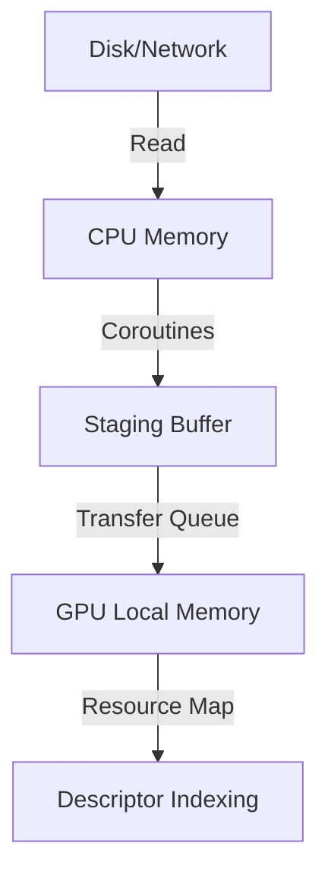

# Asset Management

The Asset Management system in Axite is designed for efficient, asynchronous resource handling with a focus on Vulkan-specific requirements.

## Core Concepts

- **Resource Registry**: A central hub mapping unique identifiers (UUIDs) to loaded resources.
- **Asynchronous Loading**: Utilizing Kotlin Coroutines for non-blocking I/O and staging.
- **Staging Manager**: Manages transfer queues and staging buffers for GPU uploads.

## Kotlin Implementation Sketch

```kotlin
interface Resource {
    val id: UUID
    fun dispose()
}

class Texture(override val id: UUID, val image: Long, val view: Long) : Resource {
    override fun dispose() {
        // Vulkan cleanup
    }
}

class AssetManager(val device: VkDevice) {
    private val registry = mutableMapOf<UUID, Resource>()
    
    suspend fun loadTexture(path: String): Texture {
        // Load file, create staging buffer, submit transfer, create VkImage
        return Texture(UUID.randomUUID(), 0L, 0L).also { registry[it.id] = it }
    }
}
```

## Mermaid Workflow


