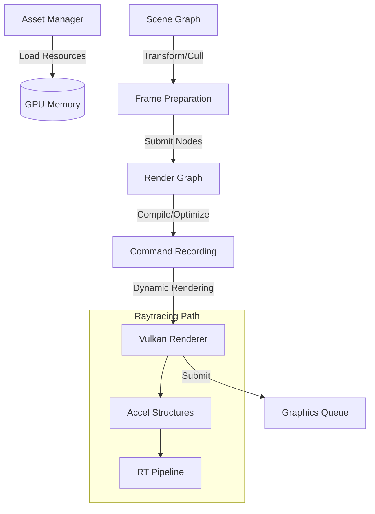

# Axite Rendering Pipeline

The Axite rendering pipeline is a modern, Vulkan-based architecture designed for flexibility, performance, and scalability. It leverages dynamic rendering and a graph-based execution model.

## Architectural Overview

The system is divided into four main pillars:

1. **[[AssetManagement|Asset Management]]**: Handles resource lifecycle and GPU uploads.
2. **[[SceneGraph|Scene Graph]]**: Manages spatial hierarchy and object data.
3. **[[RenderGraph|Render Graph]]**: Orchestrates frame execution and synchronization.
4. **[[VulkanRenderer|Vulkan Renderer]]**: Low-level hardware abstraction and Raytracing support.

## Data & Command Flow



## Core Pipeline Philosophy

- **Dynamic over Static**: Use `VK_KHR_dynamic_rendering` to eliminate fixed render passes.
- **Bindless Architecture**: Heavy use of descriptor indexing to minimize CPU-side binding overhead.
- **Hybrid Rendering**: Seamlessly switch between or combine Rasterization and Raytracing via the Render Graph.

## Implementation Details

The implementation is written in **Kotlin**, utilizing coroutines for asynchronous task management and a DSL for Render Graph definition.

### Sample Main Loop

```kotlin
class AxiteEngine {
    fun frame() {
        val sceneData = sceneGraph.update()
        val graph = renderGraph.build(sceneData)
        vulkanRenderer.execute(graph)
    }
}
```
