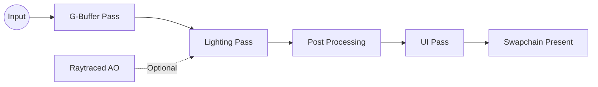

# Render Graph

The Render Graph abstracts the frame's execution logic, managing resource dependencies and Vulkan synchronization.

## Features

- **Virtual Resources**: Resources are defined by their usage, not their memory.
- **Automatic Barriers**: The graph calculates necessary `VkImageMemoryBarrier` and `VkBufferMemoryBarrier` calls.
- **Dynamic Rendering**: Compatible with `VK_KHR_dynamic_rendering` to avoid RenderPass overhead.

## Kotlin DSL Concept

```kotlin
renderGraph.addPass("ShadowMap") {
    val depth = write(Resources.ShadowDepth)
    execute { cmd ->
        cmd.beginRendering(depth)
        // Draw calls
        cmd.endRendering()
    }
}

renderGraph.addPass("MainForward") {
    val color = write(Resources.MainColor)
    val shadow = read(Resources.ShadowDepth)
    execute { cmd ->
        // Render using shadow map
    }
}
```

## Mermaid Execution Flow


