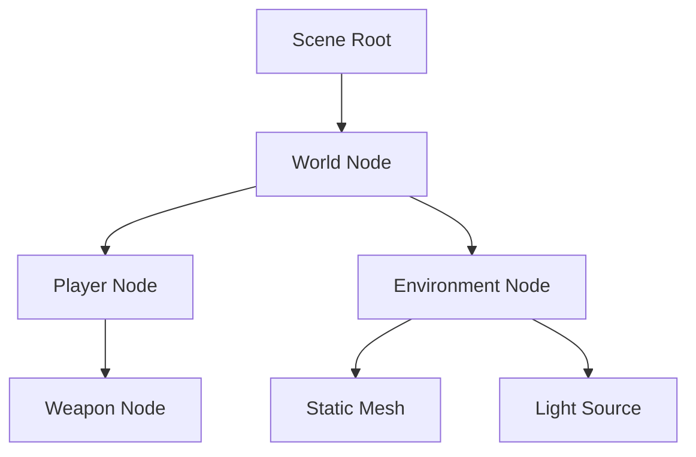

# Scene Graph

The Scene Graph manages the spatial hierarchy and logical grouping of renderable entities.

## Architecture

- **Transform Hierarchy**: Parents propagate matrices to children.
- **Culling**: Hierarchical AABB checks for frustum culling.
- **ECS Integration**: Scene nodes act as proxies for entities.

## Kotlin Structure

```kotlin
class SceneNode(
    var localTransform: Matrix4f = Matrix4f(),
    val children: MutableList<SceneNode> = mutableListOf()
) {
    var worldTransform: Matrix4f = Matrix4f()
    var parent: SceneNode? = null

    fun updateHierarchy(parentTransform: Matrix4f) {
        worldTransform = parentTransform * localTransform
        children.forEach { it.updateHierarchy(worldTransform) }
    }
}
```

## Mermaid Hierarchy


