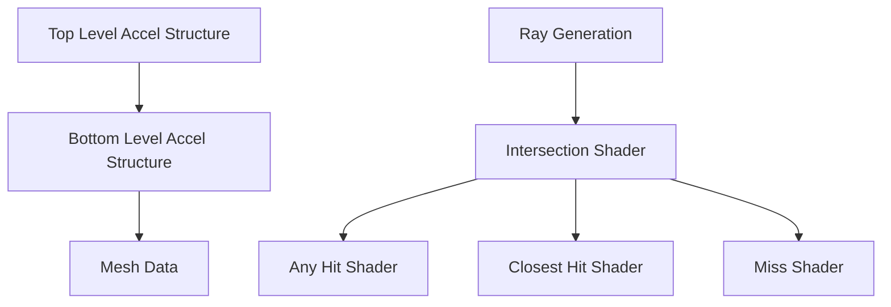

# Vulkan Renderer

This module handles the low-level Vulkan abstraction, specifically focusing on Dynamic Rendering and Raytracing.

## Key Technologies

- **VK_KHR_dynamic_rendering**: Simplifies the pipeline by removing `VkRenderPass` and `VkFramebuffer`.
- **VK_KHR_ray_tracing_pipeline**: Support for Hardware Accelerated Raytracing.
- **Descriptor Indexing**: For "Bindless" rendering.

## Raytracing Support

The renderer supports a hybrid path:
1. **Rasterization**: For primary visibility.
2. **Raytracing**: For shadows, reflections, and global illumination.

## Kotlin Rendering Loop

```kotlin
class VulkanRenderer {
    fun recordFrame(renderGraph: RenderGraph) {
        val commandBuffer = pool.allocate()
        commandBuffer.begin()
        
        // Execute Graph Passes
        renderGraph.compile().execute(commandBuffer)
        
        commandBuffer.end()
        device.queueSubmit(commandBuffer)
    }
}
```

## Mermaid Raytracing Pipeline


