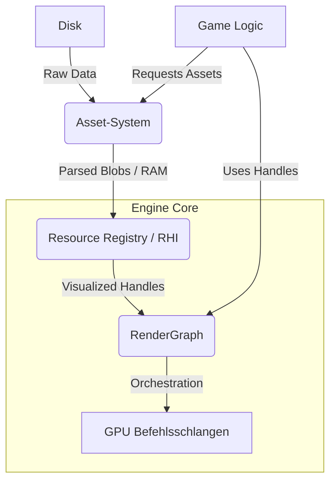
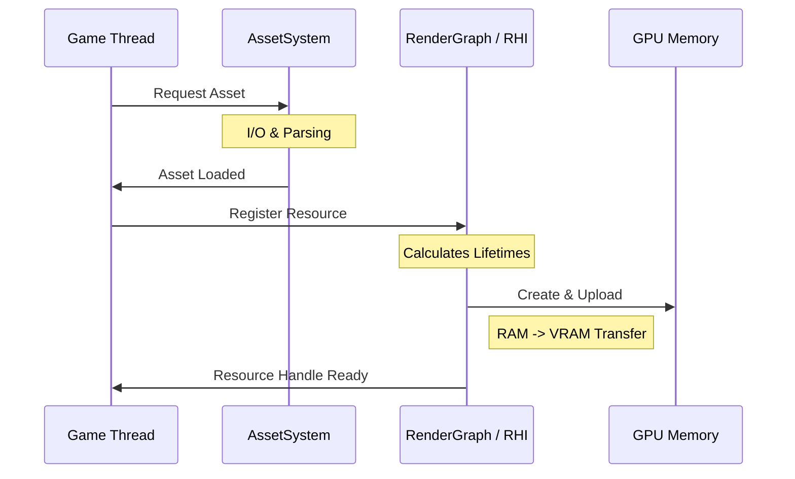
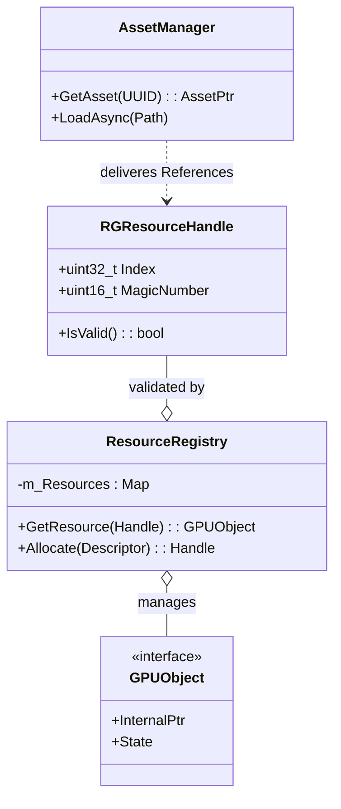

# Asset System

The **Asset System** is responsible for the importing, loading, management, and caching of all external resources used by the engine. It ensures that resources are loaded efficiently, duplicated loads are avoided, and processed data is cached for quick subsequent runs.

## Core Component: AssetManager

The `AssetManager` is the singleton (or global service) that handles all asset requests.

### Responsibilities

1. **Resource Loading**: It provides a unified interface (`GetAsset<T>(path/uuid)`) to retrieve assets.
2. **Lifecycle Management**: It maintains a registry (`m_LoadedAssets`) of currently active assets to prevent reloading the same resource multiple times.
3. **Hot Reloading**: (Planned) It watches source files for changes and triggers re-imports automatically.

## Caching Strategy

Processing raw assets (compiling shaders, compressing textures, converting 3D models) is expensive. The Asset System implements a robust caching mechanism:

- **Hashing**: Every source asset and its import settings are hashed to generate a unique signature.
- **Cache Check**: Before processing, the manager checks `m_CacheDirectory` for a pre-processed binary blob matching the hash.
- **Fast Path**: If the cache exists and is valid, the processed data is loaded directly from disk, bypassing the expensive import step.
- **Slow Path**: If the cache is missing or stale, the raw asset is processed, the result is saved to the cache, and then loaded.

## Asset Types

- **Shaders**: Handled via the [[Assets/Shader System|Shader System]].
- **Textures**: Imported via `stb_image` or similar libraries, often compressed to GPU-friendly formats (BCn, ASTC).
- **Meshes**: Imported from formats like glTF or OBJ.

## Asynchronous Loading

## Asset Handles
