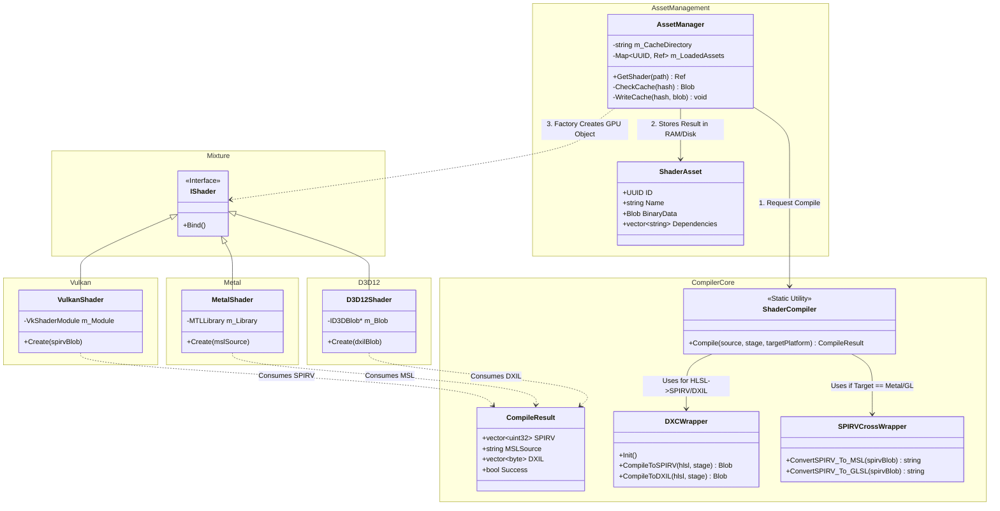

```mermaid
classDiagram
namespace AssetManagement {

	class AssetManager {
		-string m_CacheDirectory
		-Map~UUID, Ref<IAsset>~ m_LoadedAssets
		+GetShader(path) Ref<IShader>
		-CheckCache(hash) Blob
		-WriteCache(hash, blob) void
	}
	
	class ShaderAsset {
		+UUID ID
		+string Name
		+Blob BinaryData
		+vector~string~ Dependencies
	}
}

namespace CompilerCore {

	class ShaderCompiler {	
		<<Static Utility>>
		%% The Asset Manager calls this
		+Compile(source, stage, targetPlatform) CompileResult
	}
	
	class CompileResult {
		+vector~uint32~ SPIRV
		+string MSLSource
		+vector~byte~ DXIL
		+bool Success
	}

	class DXCWrapper {
		%% Wraps dxcompiler.dll / libdxcompiler.dylib
		+Init()
		+CompileToSPIRV(hlsl, stage) Blob
		+CompileToDXIL(hlsl, stage) Blob
	} 
	
	class SPIRVCrossWrapper {
		%% Wraps spirv-cross.lib
		+ConvertSPIRV_To_MSL(spirvBlob) string
		+ConvertSPIRV_To_GLSL(spirvBlob) string
	}

}

namespace Vulkan {

class VulkanShader {

-VkShaderModule m_Module

+Create(spirvBlob)

}

}

  

namespace Metal {

class MetalShader {

-MTLLibrary m_Library

+Create(mslSource)

}

}

  

namespace D3D12 {

class D3D12Shader {

-ID3DBlob* m_Blob

+Create(dxilBlob)

}

}

  

namespace Mixture {

class IShader {

<<Interface>>

+Bind()

}

}

  

%% ---------------------------------------------------------

%% RELATIONSHIPS & FLOW

%% ---------------------------------------------------------

%% Interfaces

IShader <|-- VulkanShader

IShader <|-- MetalShader

IShader <|-- D3D12Shader

  

%% Asset Manager Flow

AssetManager --> ShaderCompiler : 1. Request Compile

AssetManager --> ShaderAsset : 2. Stores Result in RAM/Disk

AssetManager ..> IShader : 3. Factory Creates GPU Object

  

%% Compiler Logic

ShaderCompiler --> DXCWrapper : Uses for HLSL->SPIRV/DXIL

ShaderCompiler --> SPIRVCrossWrapper : Uses if Target == Metal/GL

  

%% Factory Logic (How the Shader is created)

VulkanShader ..> CompileResult : Consumes SPIRV

MetalShader ..> CompileResult : Consumes MSL

D3D12Shader ..> CompileResult : Consumes DXIL
```