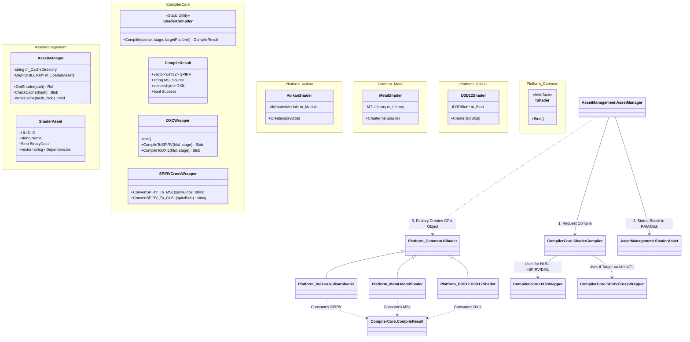

```mermaid
classDiagram

%% ---------------------------------------------------------

%% GROUP 1: ASSET MANAGEMENT (High Level Logic)

%% ---------------------------------------------------------

namespace AssetManagement {

class AssetManager {

-string m_CacheDirectory

-Map~UUID, Ref<IAsset>~ m_LoadedAssets

+GetShader(path) Ref<IShader>

-CheckCache(hash) Blob

-WriteCache(hash, blob) void

}

  

class ShaderAsset {

+UUID ID

+string Name

+Blob BinaryData

+vector~string~ Dependencies

}

}

  

%% ---------------------------------------------------------

%% GROUP 2: CROSS-COMPILER CORE (The "Brain")

%% ---------------------------------------------------------

namespace CompilerCore {

class ShaderCompiler {

<<Static Utility>>

%% The Asset Manager calls this

+Compile(source, stage, targetPlatform) CompileResult

}

  

class CompileResult {

+vector~uint32~ SPIRV

+string MSLSource

+vector~byte~ DXIL

+bool Success

}

  

class DXCWrapper {

%% Wraps dxcompiler.dll / libdxcompiler.dylib

+Init()

+CompileToSPIRV(hlsl, stage) Blob

+CompileToDXIL(hlsl, stage) Blob

}

  

class SPIRVCrossWrapper {

%% Wraps spirv-cross.lib

+ConvertSPIRV_To_MSL(spirvBlob) string

+ConvertSPIRV_To_GLSL(spirvBlob) string

}

}

  

%% ---------------------------------------------------------

%% GROUP 3: PLATFORM BACKENDS (Platform/Folder)

%% ---------------------------------------------------------

namespace Platform_Vulkan {

class VulkanShader {

-VkShaderModule m_Module

+Create(spirvBlob)

}

}

  

namespace Platform_Metal {

class MetalShader {

-MTLLibrary m_Library

+Create(mslSource)

}

}

  

namespace Platform_D3D12 {

class D3D12Shader {

-ID3DBlob* m_Blob

+Create(dxilBlob)

}

}

  

namespace Platform_Common {

class IShader {

<<Interface>>

+Bind()

}

}

  

%% ---------------------------------------------------------

%% RELATIONSHIPS & FLOW

%% ---------------------------------------------------------

%% Interfaces

Platform_Common.IShader <|-- Platform_Vulkan.VulkanShader

Platform_Common.IShader <|-- Platform_Metal.MetalShader

Platform_Common.IShader <|-- Platform_D3D12.D3D12Shader

  

%% Asset Manager Flow

AssetManagement.AssetManager --> CompilerCore.ShaderCompiler : 1. Request Compile

AssetManagement.AssetManager --> AssetManagement.ShaderAsset : 2. Stores Result in RAM/Disk

AssetManagement.AssetManager ..> Platform_Common.IShader : 3. Factory Creates GPU Object

  

%% Compiler Logic

CompilerCore.ShaderCompiler --> CompilerCore.DXCWrapper : Uses for HLSL->SPIRV/DXIL

CompilerCore.ShaderCompiler --> CompilerCore.SPIRVCrossWrapper : Uses if Target == Metal/GL

  

%% Factory Logic (How the Shader is created)

Platform_Vulkan.VulkanShader ..> CompilerCore.CompileResult : Consumes SPIRV

Platform_Metal.MetalShader ..> CompilerCore.CompileResult : Consumes MSL

Platform_D3D12.D3D12Shader ..> CompilerCore.CompileResult : Consumes DXIL
```