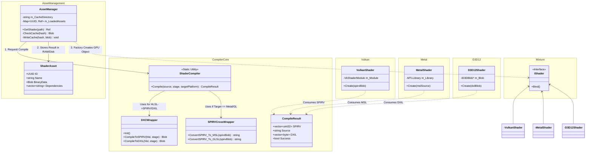

# Shader System

The **Shader System** in Mixture is designed to support modern, cross-platform shader compilation and management. It leverages **HLSL** as the primary shading language and transpiles/compiles it to the target API's intermediate language (SPIR-V, DXIL, or MSL).

## Architecture

The system is divided into two main parts: the **Offline Compiler** (Asset side) and the **Runtime Factory** (RHI side).

### 1. Compiler Core

The compilation pipeline relies on standard industry tools to ensure compatibility and optimization.

- **DXC (DirectX Shader Compiler)**: Used as the frontend compiler. It compiles HLSL code into **SPIR-V** (for Vulkan) or **DXIL** (for D3D12).
- **SPIRV-Cross**: A tool used to reflect on SPIR-V binaries and transpile them into other languages, such as **MSL** (Metal Shading Language) for macOS support.

### 2. Asset Management

The `AssetManager` orchestrates the compilation process:
1. **Request**: A shader is requested by path.
2. **Check**: The manager checks if a compiled binary exists for the current platform.
3. **Compile**: If not, `ShaderCompiler::Compile` is invoked.
4. **Store**: The resulting `ShaderAsset` (containing the binary blob) is stored in the cache.

### 3. RHI Integration

At runtime, the RHI takes the raw binary data and creates the API-specific GPU object.
- **Vulkan**: Creates `VkShaderModule` from SPIR-V.
- **Metal**: Creates `MTLLibrary` from MSL source (transpiled from SPIR-V).
- **D3D12**: Creates `ID3DBlob` containing DXIL.

## Class Diagram

The following diagram illustrates the relationship between the Asset Manager, the Compiler tools, and the backend RHI classes.

