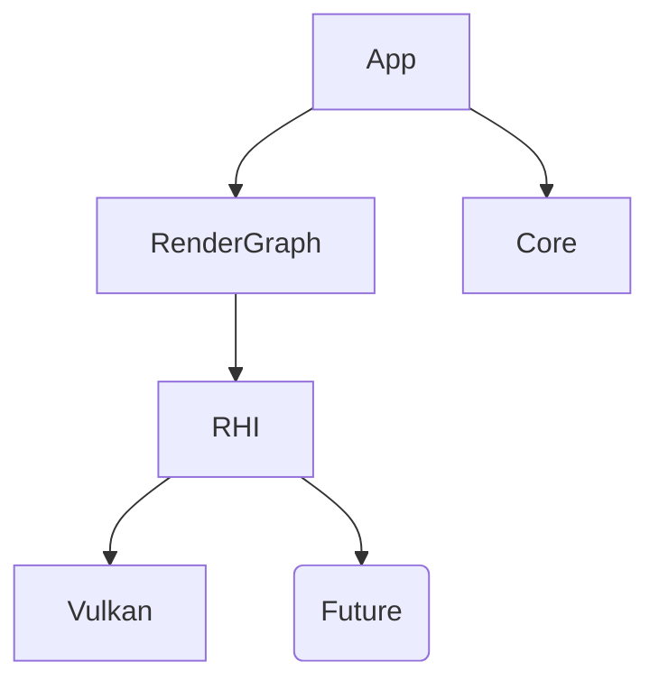

# Mixture Engine Documentation

Welcome to the **Mixture Engine** documentation. This project is a C++ rendering engine with a focus on a modern, data-driven Render Graph architecture and a hardware-agnostic Render Hardware Interface (RHI).

## Core Systems

- **[[Render/RHI|Render Hardware Interface (RHI)]]**: The abstraction layer over low-level graphics APIs (Vulkan, DX12, etc.).
- **[[Render/RenderGraph|Render Graph]]**: A directed acyclic graph (DAG) based rendering system handling resource management, synchronization, and pass execution.

## Platforms

Implementation details for specific graphics backends:

- **[[Platform/Vulkan/Index|Vulkan Backend]]**: Detailed architecture of the Vulkan implementation.

## Architecture Overview

Mixture follows a layered architecture:
1. **Core**: Windowing, Events, Time, Input.
2. **RHI**: Abstract Graphics Device, Command Lists, Resources.
3. **Render Graph**: High-level pass management built on top of RHI.
4. **App**: User layers and logic.

