# Render Graph

The **Render Graph** is the heart of Mixture's rendering pipeline. It automates resource management, memory aliasing (future), and synchronization (barriers), allowing developers to focus on *what* to render rather than *how* to synchronize it.

## Concept

Instead of manually creating dependencies and transitions, the user declares:
1. **Passes**: Logical units of work (e.g., "Shadow Pass", "Geometry Pass", "Lighting Pass").
2. **Inputs**: Resources the pass reads.
3. **Outputs**: Resources the pass writes to (or creates).

The graph then:
- **Sorts** passes topologically to determine execution order.
- **Allocates** transient resources (textures that only exist for the duration of a frame).
- **Injects Barriers** automatically to handle `Read -> Write` or `Write -> Read` transitions.

## Architecture

### 1. Setup Phase (RenderGraphBuilder)
**File**: `Mixture/Render/Graph/RenderGraphBuilder.hpp`

Inside the `Setup` lambda of a pass, you define connectivity.
- `builder.Read(handle)`: Declares a dependency.
- `builder.Write(handle)`: Declares an output.
- `builder.Create(name, desc)`: Creates a new internal transient resource.

### 2. Execution Phase (RenderGraphRegistry)
**File**: `Mixture/Render/Graph/RenderGraphRegistry.hpp`

Inside the `Execute` lambda, you get access to the actual GPU resources.
- `registry.GetTexture(handle)`: Returns the concrete `RHI::ITexture*`.
- You then record commands using the provided `RHI::ICommandList`.

## Life Cycle

```mermaid
stateDiagram-v2
    [*] --> Setup
    Setup --> Compile
    Compile --> Execute
    Execute --> [*]

    state Setup {
        direction LR
        Pass_Deklaration --> Resource_Request
        Resource_Request --> Descriptor_Creation
    }
    Note right of Setup: Dependency Declaration

    state Compile {
        Pass_Culling --> Lifetime_Analysis
        Lifetime_Analysis --> Memory_Aliasing
    }
    Note right of Compile: Engine saves VRAM by reusing memory

    state Execute {
        Barrier_Insertion --> Command_Recording
        Command_Recording --> GPU_Submission
    }
    Note right of Execute: Tatsächliche Befehle (Draw, Bind) werden gesendet (Ihr Lambda 2).
```



## Example

```cpp
graph->AddPass<MyPassData>("My Pass",
    [&](RenderGraphBuilder& builder, MyPassData& data) 
    {
        // Setup
        data.Output = ...;
        builder.Write(data.Output);
    },
    [&](RenderGraphRegistry& registry, const MyPassData& data, Ref<ICommandList> cmd) 
    {
        // Execute
        auto tex = registry.GetTexture(data.Output);
        // ... Bind and Draw
    }
);
```

## Future Improvements
- **Memory Aliasing**: Reuse memory for textures that have non-overlapping lifetimes.
- **Async Compute**: Schedule compute passes on a separate async queue.
- **Culling**: Remove passes whose outputs are never read.