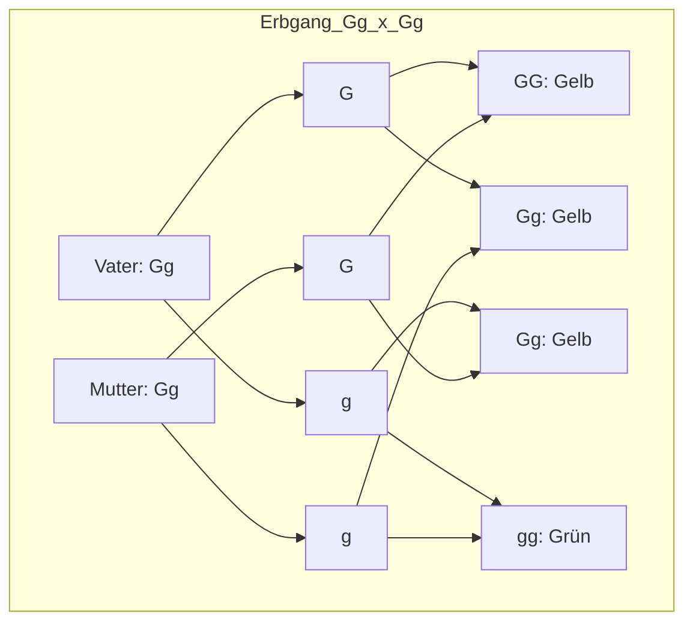

# Allele

**Tags:** #Biologie #Genetik #Grundlagen 
**Verwandte Themen:** [[Genetik]], [[Mendelsche-Regeln]], [[DNA]]

---

## 🧬 Definition
Ein **Allel** (v. griech. *allélon* „einander, gegenseitig“) ist eine von mehreren möglichen Ausprägungen eines **Gens**, das an einem bestimmten Ort (Locus) auf einem Chromosom liegt.

> [!abstract] Der Unterschied: Gen vs. Allel
> - **Gen:** Der Bauplan für ein Merkmal (z. B. "Augenfarbe").
> - **Allel:** Die konkrete Version dieses Bauplans (z. B. "Blau" oder "Braun").

---

## 🔍 Zustandsformen (Zygotie)
Da Menschen einen diploiden Chromosomensatz haben (einen von der Mutter, einen vom Vater), besitzen wir jedes Gen doppelt.

- **Homozygot (reinerbig):** Beide Allele für ein Merkmal sind identisch (z. B. `AA` oder `aa`).
- **Heterozygot (mischerbig):** Die beiden Allele sind unterschiedlich (z. B. `Aa`).

[Image of alleles on homologous chromosomes]

---

## 👑 Interaktion der Allele
In einer mischerbigen (heterozygoten) Kombination bestimmt die Interaktion, welcher **Phänotyp** (das Erscheinungsbild) sichtbar wird:

1. **Dominant:** Dieses Allel setzt sich durch (Symbol: Großbuchstabe, z. B. **A**).
2. **Rezessiv:** Dieses Allel wird unterdrückt und ist nur bei Reinerbigkeit sichtbar (Symbol: Kleinbuchstabe, z. B. **a**).
3. **Intermediär:** Die Merkmale mischen sich (z. B. Rot + Weiß = Rosa).
4. **Kodominant:** Beide Merkmale sind gleichzeitig voll ausgeprägt (z. B. Blutgruppe AB).

---

## 📊 Beispiel: Mendelsche Erbsen
| Genotyp | Typ | Phänotyp (Aussehen) |
| :--- | :--- | :--- |
| **GG** | homozygot dominant | Gelbe Erbse |
| **Gg** | heterozygot | Gelbe Erbse (Gelb dominiert) |
| **gg** | homozygot rezessiv | Grüne Erbse |

[Image of Punnett square]

---

## 🛠 Visualisierung der Vererbung (Mermaid)
In Obsidian wird daraus automatisch ein Diagramm erstellt:

